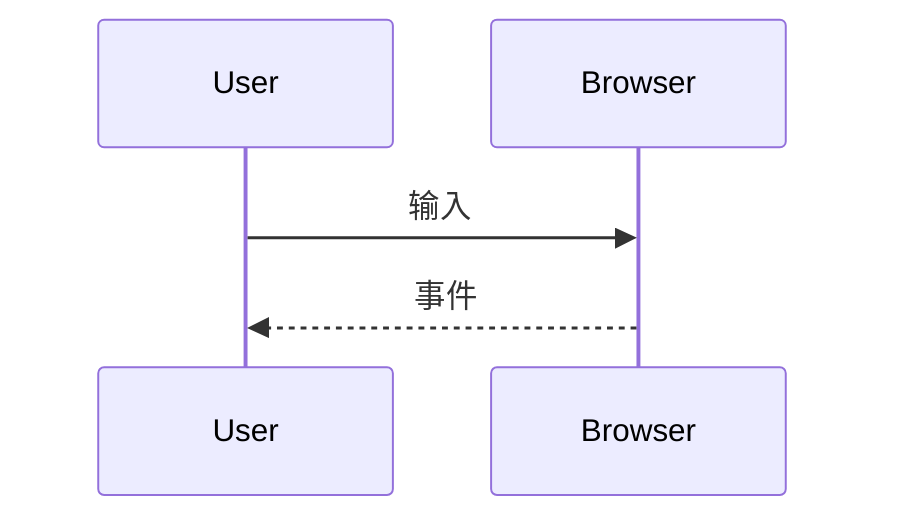
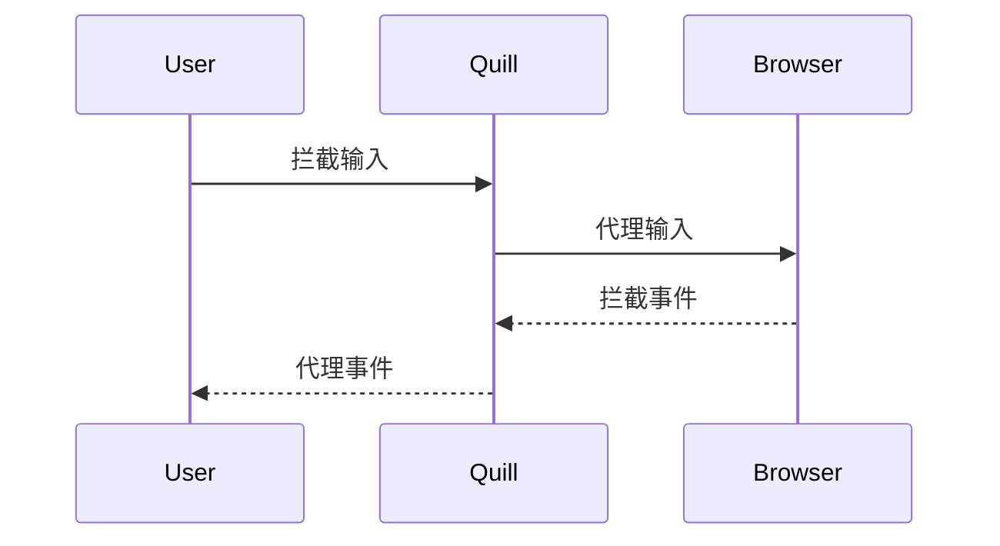

# Web 富文本编辑器演进

前端天坑？光标丢失？协同编辑？

<div class="pt-12">
  <span @click="$slidev.nav.next" class="px-2 py-1 rounded cursor-pointer" hover="bg-white bg-opacity-10">
    按空格进入下一页 <carbon:arrow-right class="inline"/>
  </span>
</div>

<div class="abs-br m-6 flex gap-2">
  <button @click="$slidev.nav.openInEditor()" title="Open in Editor" class="text-xl icon-btn opacity-50 !border-none !hover:text-white">
    <carbon:edit />
  </button>
</div>

---

# 什么是富文本？

<br/>

<v-click>

富文本 Rich Text ，相对于纯文本 Plain Text 来说，就是有通用的格式选项（比如加粗和斜体）来格式化的文本。


</v-click>


---
layout: image-x
image: /assets/img/vscode-on-watch.jpg
---

# Web + 富文本编辑器

- 浏览器？
- WebAssembly?
- Electron?
- Figma, VS Code

<div class="mt-10 opacity-50">“一次编写，随处运行”</div>

<!--
众所周知，Web 是目前来说最通用的平台，不管是电脑、手机、游戏机、汽车还是 Kindle ，只要有浏览器就能打开网站。加上 WebAssembly 和 Electron 等技术和工具的支持，在 Web 上执行复杂操作的超级应用（Figma, VS Code）也在陆续登场。面对 “一次编写，随处运行” 的诱惑下，许多传统桌面应用也都在逐步地将阵地拓展到 Web 端，富文本编辑器就是其中之一。
-->

---

# 富文本编辑器 = 坑？

> 在 Web 前端业界内，富文本编辑器是公认的天坑。

<br />

<v-clicks>

- 焦点
- 光标选区
- 撤回栈
- 粘贴
- 不同浏览器
- IME 组合输入
- RTL 语言
- 手机端
- 协同编辑
- 。。。

</v-clicks>

<!--
在 Web 前端业界内，富文本编辑器是公认的天坑。Web 开发好处是跨平台，但问题也是因为跨平台带来的兼容问题。跨平台只是能在各个平台上跑起来，但是跑起来怎么样就是天坑所在了。

在 Web 开发编辑器首先要处理好 焦点、光标选区、撤回栈、从外部粘贴内容解析等等的坑，然后考虑兼容不同浏览器（Chrome、Firefox、Safari 等）...... 处理好了最基本的英文输入后，以中文使用者为代表的用户来要求支持 IME 组合输入了...... 解决了 IME 输入后，RTL 语言（希伯来语、阿拉伯语）用户来了...... 手机用户来了......   协同编辑用户来了......
-->

---

# 落后的生产力与人们日益增长的需求之间的矛盾

<br />

<v-clicks>

**落后生产力：**
- Web 相关标准推进缓慢
- 浏览器厂商对于相同操作或者场景实现方式的不同，导致兼容性的问题
- 使用 HTML DOM 描述富文本内容有太多不可控制的情况

<br />

**日益增长的需求：**
- 不确定的交互意图，比如按 Delete 键，不同的焦点位置有不同的情况需要考虑
- 内容输入的多样性，比如有：打字键入、粘贴、拖拽等，每个处理起来都相当复杂
- 大量需要拦截阻止和代理的浏览器默认行为，保证数据的完整性和正确性
- 用户对于编辑器的使用要求越来越高，比如：合并单元格、列表多级嵌套、协同编辑、版本对比、段落标注，大家都认为这是基本需求，其实这里面的技术难度是超出大家的想象的。


</v-clicks>

---

# 编辑器技术阶段一览

| 阶段 | 描述 | 典型产品 |
| :----| :---- | :---- |
| L0 | <ol><li> 强依赖浏览器 DOM API ( contenteditable, document.execCommand ) </li><li>视图即数据</li></ol> | <ol class="list"><li>UEditor</li><li>TinyMCE</li><li>CKEditor 1 ~ 4</li></ol> |
| L1 | <ol><li> 仍然基于 contenteditable </li><li>抛弃 document.execCommand 操作内容，改为自己实现</li><li>有抽象的数据模型来描述富文本编辑器的内容与状态</li></ol> | <ol class="list"><li>Quill</li><li>Slate</li><li>CKEditor 5</li><li>Draft.js</li><li>ProseMirror</li><li>wangEditor v5</li></ol> |
| L2 | <ol><li> 抛弃 contenteditable ，改为自己实现 </li><li>抛弃 document.execCommand 操作内容，改为自己实现</li><li>自己实现排版引擎</li></ol> | <ol class="list"><li>Google Docs</li></ol> |

<style>
  ol {
    list-style: number;
  }

  .list {
    @apply text-sm;
  }
</style>

---
layout: two-cols
---
# L0

<br>

编辑：contenteditable
<br />
操作：document.execCommand


<br>
<div class="mt-20"></div>

**优势：**
1. 技术门槛低。
2. 基于浏览器原生编辑能力，输入非常流畅。
3. 没有令人头疼的组合输入问题。

<template v-slot:right>

<br/>

```html {2}
<!-- HTML -->
<div contenteditable>
  I am an editor now!
</div>
```

<br/>

```javascript
// JavaScript
document.execCommand('copy')
```

<br/>
<div class="mt-10"></div>

**劣势：**
1. 相同操作在不同浏览器上会有不同实现。
2. 输出富文本内容是 HTML ，不利于管理数据。
3. 扩展复杂的富文本很困难。
4. 没有办法实现协同编辑。

</template>

<style>
  ol {
    list-style: number;
  }
</style>


<!-- L0 阶段的编辑器主要是是依赖了浏览器原生的 contenteditable API 来实现编辑，以 document.execCommand API 来实现多种操作，比如加粗、绑定链接、复制粘贴等等。
技术门槛低，只要使用了以上两个 API ，就可以让网页具备编辑能力。 -->

---

# L0


<v-click>

```html
<strong><em>Markji</em></strong>

<em><strong>Markji</strong></em>

<strong><em>M</em></strong><strong><em>ark</em></strong><strong><em>ji</em></strong>

<em><strong>Mark</strong></em><em><strong>j</strong></em><em><strong>i</strong></em>
```

</v-click>


---

# L1


<div class="w-full flex justify-center my-10">
  
  
  
  
  
</div>

<v-click>

**特点：**
1. 仍然依赖于 contenteditable API 用于内容编辑，但不再依赖 document.execCommand API 来操作内容，改为自己实现。
2. 有抽象的数据模型来描述富文本编辑器的内容与状态。

</v-click>

<style>
  img {
    @apply ml-5;
    width: 100px;
    flex: 1;
    object-fit: contain;
  }

  ol {
    list-style: number;
  }
</style>

---
layout: two-cols
---
# 2012 - Quill


<br/>

Quill 是 API 驱动的富文本编辑器框架，提供**开箱即用**的编辑器体验。

::right::

<div v-click="1">
  

  <p align="center">Jason Chen</p>
</div>

<arrow v-click="2" x1="580" x2="460" y1="180" y2="180" width="1" />


<!-- Quill 的作者 Jason Chen 是一名华裔，Quill 其实算是 Jason 的一个 Side Project，当初是创办了一家公司，专门做类似 Google Docs 的协作编辑器，因此自己写了 Quill 出来使用。 -->

---
layout: two-cols
---

# 2012 - Quill

## Before:

<br/>
<br/>



::right::

<br />
<br />
<br />

## After:

<br/>
<br/>


<!-- Quill 对 DOM Tree 以及数据的修改操作进行了抽象，从而实际使用时不需要我们对 DOM 操作，而是通过 Quill 的 API 进行操作 -->

---
layout: two-cols
---

# 2012 - Quill

- 数据 ===> Delta
- 文档树 ===> Parchment
- DOM Node ===> Blot


::right::


```json {all|3-8|9-11|12-17|18-20|2|all}
{
    "ops": [
        {
            "attributes": {
                "bold": true
            },
            "insert": "Check"
        },
        {
            "insert": " "
        },
        {
            "attributes": {
                "link": "https://www.markji.com/"
            },
            "insert": "this"
        },
        {
            "insert": " out ~"
        }
    ]
}

```

<!-- 有了这层抽象后，原本的对 DOM 的直接操作就变成了对 Blot 的操作，这些操作用 Delta 来表示。Quill 在 Delta 中抛弃了 DOM 的节点树的层次，因此完全看不出包裹文字的标签和节点关系，只有一个扁平化后的数组 ops。 -->

---

# 2012 - Quill

扁平化数据结构有利于协同编辑

> 用户案例：石墨文档


<br/>

<v-clicks>

Quill 的特点是：
1. 依赖浏览器原生编辑能力 contentEditable (L1)
2. 引入了一层抽象的数据结构用以描述内容以及行为
3. 对协同编辑支持良好
4. 输出结构可以是字符串也可以是 Delta （JSON），但 Delta 作为数据模型可读性不高

</v-clicks>


<style>
  ol {
    list-style: number;
  }
</style>

<!-- Delta 的扁平化结构其实是协同编辑中的 OT 模型的一种实现，因此 Quill 也是生来就是为了协同编辑而设计的。扁平化带来的好处是对性能提升有帮助，弊端则是在表示一些复杂的嵌套内容时会比较吃力。 -->

---

# 2015 - ProseMirror

<div class="my-20 flex items-center justify-between">
  <div class="flex flex-col items-center">
    
    <span>Marijn Haverbeke</span>
  </div>


  <ul class="inline-flex flex-col">
    <li>CodeMirror</li>
    <li>acorn</li>
  </ul>

  

</div>

<arrow x1="270" y1="260" x2="370" y2="260" width="1" />

<arrow x1="520" y1="260" x2="620" y2="260" width="1" />

<!-- Marijn 是 CodeMirror 编辑器和 acorn 解析器的作者，前者已经在 Chrome 和 Firefox 自带的调试工具里使用了，后者则是 babel 的依赖。为了有更多的收入，Marijn 开始了新的项目，ProseMirror 。

Marijn 觉得当时市面上的开源编辑器都没有一个采用他认为是理想的方法，且很多还是使用着旧的范式来设计，使用着 contentEditable来实现。这样子开发者对文档内容能控制的范围就很小，而这又是很容易被用户和浏览器修改的。虽然 ProseMirror 还是基于 contentEditable 实现编辑功能了，毕竟自己重新实现一套选区逻辑太麻烦了。 -->

---
layout: two-cols
---

# 2015 - ProseMirror


::right::

```json {all|4-12|6-10,19-27|all}
{
    "type": "paragraph",
    "content": [
        {
            "type": "text",
            "marks": [
                {
                    "type": "strong"
                }
            ],
            "text": "Check"
        },
        {
            "type": "text",
            "text": " "
        },
        {
            "type": "text",
            "marks": [
                {
                    "type": "link",
                    "attrs": {
                        "href": "https://www.markji.com",
                        "title": ""
                    }
                }
            ],
            "text": "this"
        },
        {
            "type": "text",
            "text": " out ~"
        }
    ]
}
```

<style>
  pre {
    font-size: 0.5em !important;
    line-height: 1.5 !important;
  }
</style>

---

# 2015 - ProseMirror


> 用户案例：Confluence, flomo

<br/>

<v-clicks>

**ProseMirror 的特点是：**
1. 依赖浏览器原生编辑能力 contentEditable (L1)
2. 更抽象的 JSON 文档模型。ProseMirror 只定义了可配置的模型框架，具体的结构可以在实际开发的时候自定义。
3. 嵌套的树形结构。能支持复杂结构的内容。
4. 对协同编辑的良好支持。从诞生之初，ProseMirror 就开始关注着协同编辑的支持。
5. 1.0 后加入了不可变数据，使得编辑器的数据处理有了一个完整的数据流，稳定且可控。

</v-clicks>

<style>
  ol {
    list-style: number;
  }
</style>


---

# 2016.02 - Draft.js

<div class="mx-15 my-20 flex justify-between items-center text-3xl">
  <span>React</span>
  <span>+</span>
  <span>EditorState</span>
  <span>=</span>
  
</div>

- EditorState & ContentState
- Immutable

<!-- 彼时还叫 Facebook 的 Meta 开源了 Draft.js ，既然都是同一个公司的，Draft.js 就在视图层方面使用了 React 渲染 UI 。这也是第一个 React + 编辑器结合的案例，React 的流行也让使用者可以快速地直接基于 Draft.js 进行二次开发。

Draft.js 不仅外表有 React ，内里也是有很深的 React 的影子，类似 Redux 等状态管理的 EditorState 和 ContentState ，在数据层使用 Immutable等特性。JS 对象的属性是可以随意赋值的，也就是 mutable 可变的。而相对地，不可变的数据类型不允许随意赋值，每次通过 Immutable API 的修改，都会生成一个新的引用。 -->

---

# 2016.02 - Draft.js

> 用户案例：知乎

<br/>

<v-clicks>

**Draft.js 的特点是：**
1. 依赖浏览器原生编辑能力 contentEditable (L1)
2. 用 React 来实现视图层
3. 内容的存储和渲染逻辑分离
4. 使用 Immutable 数据
5. 虽然也抽象了基于 JSON 的数据模型，但是对于嵌套数据的支持有些弱

</v-clicks>


<style>
  ol {
    list-style: number;
  }
</style>

---
layout: image-left
image: '/assets/img/slate-meme.jpg'
---

# 2016.06 - Slate


**Ian Storm Taylor**


<v-click>

- Meidum
- Google Docs
- Dropbox Paper
- ...

</v-click>


<!-- 此时市面上已有许多编辑器轮子在卷了，但是 Ian Storm Taylor 在开发自己的 CMS 产品时，仍然觉得没有一个好用的编辑器，他觉得这些编辑器如果只是用来做一些简单的产品的话，是挺不错的了，但是如果想要开发像 Medium 、Google Docs 和 Dropbox Paper 这些大型应用的话，就太难太难了，于是就有了 Slate。 -->

---

# 2016.06 - Slate

Slate 同样的是一个编辑器框架，而不是开箱即用的编辑器工具。

<br />

<v-click>

- Immutable (Draft.js)
- 插件机制 (Draft.js)
- React 渲染视图 (Draft.js)
- 嵌套数据结构 (ProseMirror)
- Schema (ProseMirror)

</v-click>

<!-- Slate 同样的是一个编辑器框架，而不是开箱即用的编辑器工具。作为晚辈的 Slate 集合了前辈们的许多优点，从 Draft.js 那里参考的 Immutable 数据、插件机制和 React 视图层，又从 ProseMirror 借鉴了嵌套数据结构和 Schema 约束规则。整合了许多编辑器框架的核心特性，又加上框架理念先进和作者对架构的追求（时至今日 2022 ，仍然是 beta 的状态，还没到 1.0），Slate 在社区上还是比较受欢迎的。 -->

<style>
  li {
    @apply text-xl leading-loose;
  }
</style>

<!--
Slate 同样的是一个编辑器框架，而不是开箱即用的编辑器工具。作为晚辈的 Slate 集合了前辈们的许多优点，从 Draft.js 那里参考的 Immutable 数据、插件机制和 React 视图层，又从 ProseMirror 借鉴了嵌套数据结构和 Schema 约束规则。整合了许多编辑器框架的核心特性，又加上框架理念先进和作者对架构的追求（时至今日 2022 ，仍然是 beta 的状态，还没到 1.0），Slate 在社区上还是比较受欢迎的。
-->

---
layout: two-cols
---

# 2016.06 - Slate


::right::

```json
{
    "object": "block",
    "type": "paragraph",
    "nodes": [
      {
        "object": "text",
        "text": "This is editable "
      },
      {
        "object": "text",
        "text": "rich",
        "marks": [{ "type": "bold" }]
      },
      {
        "object": "text",
        "text": " text, "
      },
      {
        "object": "text",
        "text": "much",
        "marks": [{ "type": "italic" }]
      },
      {
        "object": "text",
        "text": " better than a "
      },
      {
        "object": "text",
        "text": "<textarea>",
        "marks": [{ "type": "code" }]
      },
      {
        "object": "text",
        "text": "!"
      }
    ]
}
```

<style>
  pre {
    @apply text-xs !important;
  }
</style>

---

# 2016.06 - Slate

<br/>

<v-clicks>

**此时 Slate 的特点是：**
1. 依赖浏览器原生编辑能力 contentEditable (L1)
2. 用 React 来实现视图层
3. 支持嵌套的 JSON 数据结构
4. Immutable 数据
5. 插件机制为核心
6. 有约束数据的 Schema

</v-clicks>

<style>
  ol {
    list-style: number;
  }
</style>

---

# 2019 - Slate 0.50+

<v-click>
<div class="leading-normal mr-10 my-10">
Slate 在架构上进行了一个大更新，作者称 “整个框架都从头开始重新考虑了”
</div>
</v-click>

<v-click>

1. 将底层逻辑抽离出来 Slate Core ，与视图层分离
2. 用 TypeScript 重写
3. 简化插件机制，插件不再与渲染逻辑耦合
4. 用简单的 JSON 对象替换 Immutable.js
5. 自有概念和一些 Commands 更精简更抽象，改名为 Transforms

</v-click>

<style>
  ol {
    list-style: number;
  }
</style>

---
layout: two-cols
---

# 2019 - Slate 0.50+


<v-click>

```json
{
    type: 'paragraph',
    children: [
      { text: 'This is editable ' },
      { text: 'rich', bold: true },
      { text: ' text, ' },
      { text: 'much', italic: true },
      { text: ' better than a ' },
      { text: '<textarea>', code: true },
      { text: '!' },
    ],
}
```

</v-click>

::right::

<div class="mt-20"></div>

<v-clicks>

> 用户案例：钉钉文档、语雀、飞书


**这时候 Slate 的特点是：**
1. 依赖浏览器原生编辑能力 contentEditable (L1)
2. 非常简洁的支持嵌套的数据模型
3. 整体架构采用纯函数 + 接口的方式，思路和代码都非常简洁
4. 插件机制支持开发强大的功能
5. 整体的设计理念与 DOM 很像


</v-clicks>


<style>

  pre {
    @apply w-6/7;
  }
  ol {
    list-style: number;
  }
</style>

---

# 2022 - Lexical

<div class="my-10 flex items-center justify-between">
  

  <span class="font-bold"> ==========> </span>

  
</div>

<v-clicks>

**特点：**
1. 依赖浏览器原生编辑能力 contentEditable (L1)
2. 保留了 Draft.js 中的一些概念（EditorState）
3. 不与 React 绑定了，可以用各种框架实现视图层
4. 整个框架挺轻便的，几乎没有什么其他的依赖

<br/>

> 用户案例：Meta

</v-clicks>


<!-- 由于 Draft.js 在以往兼容浏览器方面做了很多的脏活，且这些是现在不太必要的，同时为了改善开发者体验（很多开发者吐槽 Draft.js 不好用），Meta 又开源了一款新的编辑器框架 Lexical ，旨在替换 Draft.js。

目前看来暂时没有什么特别创新的概念，主要也还是吸收了其他编辑器框架的优点： -->


<style>
  ol {
    list-style: number;
  }
</style>

<!--
由于 Draft.js 在以往兼容浏览器方面做了很多的脏活，且这些是现在不太必要的，同时为了改善开发者体验（很多开发者吐槽 Draft.js 不好用），Meta 又开源了一款新的编辑器框架 Lexical ，旨在替换 Draft.js。
-->

---

# L2

Google Docs, WPS, 腾讯文档...

<v-clicks>


- 光标系统
- 文本布局系统
- 字体解析
- ...

</v-clicks>

<!-- 前面都有说到，凭借浏览器的contenteditable API，可以快速地开发出一款编辑器出来，但是各种兼容问题太多了，别看现在大多数编辑器框架还在 L1 ，其实早在 2010 年，财力雄厚的 Google 就已经开始抛弃浏览器的 contenteditable 了，新版 Google Docs 基于 Canvas 自己研发光标系统、文本布局系统和字体解析，因此除了自己的抽象数据结构外，连编辑操作都是自己实现了，编辑的呈现效果一致了，那协同编辑就自然水到渠成了。
当然，Google Docs 的核心技术没有开源，这种拼钱的工作还是得牢牢掌握在自己手中，国内的腾讯文档和 WPS 等编辑器也算是 L2 的，不一定是用 Canvas ，但思路都是自己实现编辑布局功能，弃用浏览器的 contenteditable 。 -->

---
layout: quote
align: center
---

# 前路漫漫，任重道远

<!-- contenteditable is terrible, 但是编辑器已经最小化了对它的使用，比之更为严峻的是，操作系统、浏览器、输入法相互组合形成的紊乱生态 —— 一个编辑器无法控制的，但产品又期望在上面开出繁花的生态。所以才说，Web 富文本编辑器是前端的天坑之一。 -->
