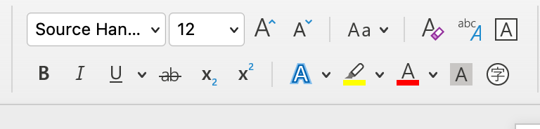
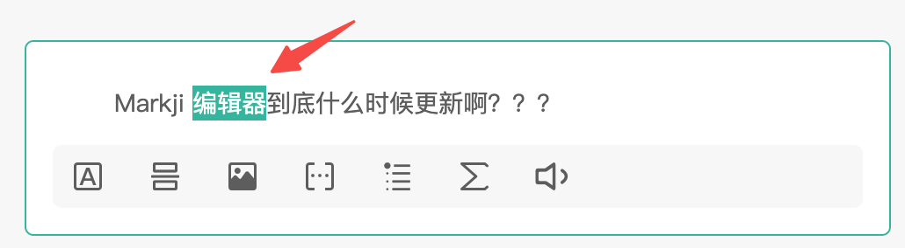

# Web 富文本编辑器演进

前端天坑？光标丢失？协同编辑？

<div class="pt-12">
  <span @click="$slidev.nav.next" class="px-2 py-1 rounded cursor-pointer" hover="bg-white bg-opacity-10">
    按空格进入下一页 <carbon:arrow-right class="inline"/>
  </span>
</div>

<div class="abs-br m-6 flex gap-2">
  <button @click="$slidev.nav.openInEditor()" title="Open in Editor" class="text-xl icon-btn opacity-50 !border-none !hover:text-white">
    <carbon:edit />
  </button>
</div>

---

# 什么是富文本？

<br/>
富文本 Rich Text ，相对于纯文本 Plain Text 来说，就是有通用的格式选项（比如加粗和斜体）来格式化的文本。




---
layout: image-x
image: assets/img/vscode-on-watch.jpg
---

# Web + 富文本编辑器

- 浏览器？
- WebAssembly?
- Electron?
- Figma, VS Code

<div class="mt-10 opacity-50">“一次编写，随处运行”</div>

<!--
众所周知，Web 是目前来说最通用的平台，不管是电脑、手机、游戏机、汽车还是 Kindle ，只要有浏览器就能打开网站。加上 WebAssembly 和 Electron 等技术和工具的支持，在 Web 上执行复杂操作的超级应用（Figma, VS Code）也在陆续登场。面对 “一次编写，随处运行” 的诱惑下，许多传统桌面应用也都在逐步地将阵地拓展到 Web 端，富文本编辑器就是其中之一。
-->

---

# 富文本编辑器 = 坑？

> 在 Web 前端业界内，富文本编辑器是公认的天坑。

<br />

- 焦点
- 光标选区
- 撤回栈
- 粘贴
- 不同浏览器
- IME 组合输入
- RTL 语言
- 手机端
- 协同编辑
- 。。。

<!--
在 Web 前端业界内，富文本编辑器是公认的天坑。Web 开发好处是跨平台，但问题也是因为跨平台带来的兼容问题。跨平台只是能在各个平台上跑起来，但是跑起来怎么样就是天坑所在了。

在 Web 开发编辑器首先要处理好 焦点、光标选区、撤回栈、从外部粘贴内容解析等等的坑，然后考虑兼容不同浏览器（Chrome、Firefox、Safari 等）...... 处理好了最基本的英文输入后，以中文使用者为代表的用户来要求支持 IME 组合输入了...... 解决了 IME 输入后，RTL 语言（希伯来语、阿拉伯语）用户来了...... 手机用户来了......   协同编辑用户来了......
-->

---

# 落后的生产力与人们日益增长的需求之间的矛盾

<br />

**落后生产力：**
- Web 相关标准推进缓慢
- 浏览器厂商对于相同操作或者场景实现方式的不同，导致兼容性的问题
- 使用 HTML DOM 描述富文本内容有太多不可控制的情况

<br />

**日益增长的需求：**
- 不确定的交互意图，比如按 Delete 键，不同的焦点位置有不同的情况需要考虑
- 内容输入的多样性，比如有：打字键入、粘贴、拖拽等，每个处理起来都相当复杂
- 大量需要拦截阻止和代理的浏览器默认行为，保证数据的完整性和正确性
- 用户对于编辑器的使用要求越来越高，比如：合并单元格、列表多级嵌套、协同编辑、版本对比、段落标注，大家都认为这是基本需求，其实这里面的技术难度是超出大家的想象的。


---

# 编辑器技术基础知识



<br />

在 Web 开发中，选区的介绍可以分为两个对象，**Selection** 和 **Range** 。
- `Selection` 对象表示用户选择的文本范围或插入符号的当前位置。它代表页面中的文本选区，可能横跨多个元素。文本选区由用户拖拽鼠标经过文字而产生。
- `Range` 接口表示一个包含节点与文本节点的一部分的文档片段。

<!--
最最最基础的网页编辑器，肯定离不开 选区 和 光标 两个概念。但其实光标只是一种特殊的选区，因此这里主要介绍一下选区。
-->

---

# 编辑器技术阶段一览

| 阶段 | 描述 | 典型产品 |
| :----| :---- | :---- |
| L0 | <ol><li> 强依赖浏览器 DOM API ( contenteditable, document.execCommand ) </li><li>视图即数据</li></ol> | <ol class="list"><li>UEditor</li><li>TinyMCE</li><li>CKEditor 1 ~ 4</li></ol> |
| L1 | <ol><li> 仍然基于 contenteditable </li><li>抛弃 document.execCommand 操作内容，改为自己实现</li><li>有抽象的数据模型来描述富文本编辑器的内容与状态</li></ol> | <ol class="list"><li>Quill</li><li>Slate</li><li>CKEditor 5</li><li>Draft.js</li><li>ProseMirror</li><li>wangEditor v5</li></ol> |
| L2 | <ol><li> 抛弃 contenteditable ，改为自己实现 </li><li>抛弃 document.execCommand 操作内容，改为自己实现</li><li>自己实现排版引擎</li></ol> | <ol class="list"><li>Google Docs</li></ol> |

<style>
  ol {
    list-style: number;
  }

  .list {
    @apply text-sm;
  }
</style>

---
layout: two-cols
---
# L0

<br>

编辑：contenteditable
<br />
操作：document.execCommand


<br>
<div class="mt-20"></div>

**优势：**
1. 技术门槛低。
2. 基于浏览器原生编辑能力，输入非常流畅。
3. 没有令人头疼的组合输入问题。

<template v-slot:right>

<br/>

```html {2}
<!-- HTML -->
<div contenteditable>
  I am an editor now!
</div>
```

<br/>

```javascript
// JavaScript
document.execCommand('copy')
```

<br/>
<div class="mt-10"></div>

**劣势：**
1. 相同操作在不同浏览器上会有不同实现。
2. 输出富文本内容是 HTML ，不利于管理数据。
3. 扩展复杂的富文本很困难。
4. 没有办法实现协同编辑。

</template>

<style>
  ol {
    list-style: number;
  }
</style>


<!-- L0 阶段的编辑器主要是是依赖了浏览器原生的 contenteditable API 来实现编辑，以 document.execCommand API 来实现多种操作，比如加粗、绑定链接、复制粘贴等等。
技术门槛低，只要使用了以上两个 API ，就可以让网页具备编辑能力。 -->

---


<v-click>

```html
<strong><em>Markji</em></strong>

<em><strong>Markji</strong></em>

<strong><em>M</em></strong><strong><em>ark</em></strong><strong><em>ji</em></strong>

<em><strong>Mark</strong></em><em><strong>j</strong></em><em><strong>i</strong></em>
```

</v-click>


---

# L1


<div class="w-full flex justify-center my-10">
  
  
  
  
  
</div>

<v-click>

**特点：**
1. 仍然依赖于 contenteditable API 用于内容编辑，但不再依赖 document.execCommand API 来操作内容，改为自己实现。
2. 有抽象的数据模型来描述富文本编辑器的内容与状态。

</v-click>

<style>
  img {
    @apply ml-5;
    width: 100px;
    flex: 1;
    object-fit: contain;
  }

  ol {
    list-style: number;
  }
</style>

---

# 2012 - Quill


<br/>

> Quill 是 API 驱动的富文本编辑器框架，提供开箱即用的编辑器体验。