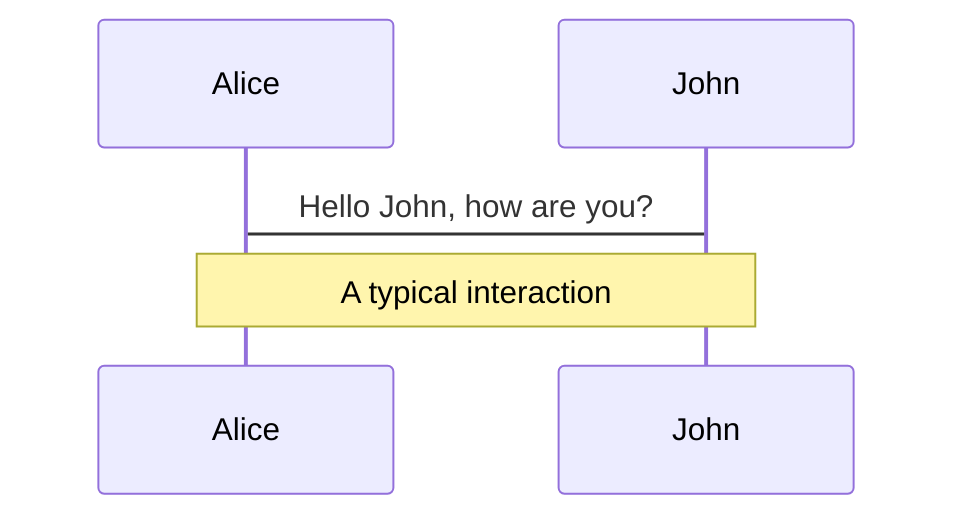
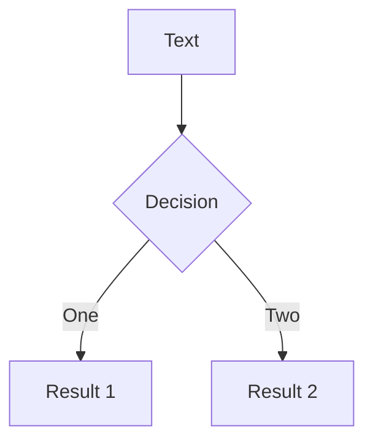
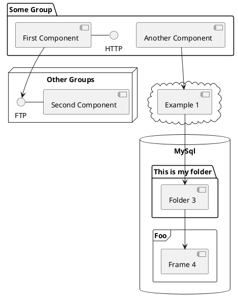

# Web 富文本编辑器演进

前端天坑？光标丢失？协同编辑？

  
    按空格进入下一页 <carbon:arrow-right class="inline"/>
  

  <button @click="$slidev.nav.openInEditor()" title="Open in Editor" class="text-xl icon-btn opacity-50 !border-none !hover:text-white">
    <carbon:edit />
  </button>

---

# 什么是富文本？

 
富文本 Rich Text ，相对于纯文本 Plain Text 来说，就是有通用的格式选项（比如加粗和斜体）来格式化的文本。

---
layout: image-x
image: assets/img/vscode-on-watch.jpg
---

# Web + 富文本编辑器

- 浏览器？
- WebAssembly?
- Electron?
- Figma, VS Code

“一次编写，随处运行”

---

# 富文本编辑器 = 坑？

> 在 Web 前端业界内，富文本编辑器是公认的天坑。

 

- 焦点
- 光标选区
- 撤回栈
- 粘贴
- 不同浏览器
- IME 组合输入
- RTL 语言
- 手机端
- 协同编辑
- 。。。

---

# 落后的生产力与人们日益增长的需求之间的矛盾

 

**落后生产力：**
- Web 相关标准推进缓慢
- 浏览器厂商对于相同操作或者场景实现方式的不同，导致兼容性的问题
- 使用 HTML DOM 描述富文本内容有太多不可控制的情况

 

**日益增长的需求：**
- 不确定的交互意图，比如按 Delete 键，不同的焦点位置有不同的情况需要考虑
- 内容输入的多样性，比如有：打字键入、粘贴、拖拽等，每个处理起来都相当复杂
- 大量需要拦截阻止和代理的浏览器默认行为，保证数据的完整性和正确性
- 用户对于编辑器的使用要求越来越高，比如：合并单元格、列表多级嵌套、协同编辑、版本对比、段落标注，大家都认为这是基本需求，其实这里面的技术难度是超出大家的想象的。

---

# 编辑器技术基础知识

 

在 Web 开发中，选区的介绍可以分为两个对象，**Selection** 和 **Range** 。
- `Selection` 对象表示用户选择的文本范围或插入符号的当前位置。它代表页面中的文本选区，可能横跨多个元素。文本选区由用户拖拽鼠标经过文字而产生。
- `Range` 接口表示一个包含节点与文本节点的一部分的文档片段。

---

# 编辑器技术阶段一览

| 阶段 | 描述 | 典型产品 |
| :----| :---- | :---- |
| L0 | <ul><li> 强依赖浏览器 DOM API ( contenteditable, document.execCommand ) </li><li>视图即数据</li></ul> | UEditor, TinyMCE, CKEditor 1 ~ 4 |
| L1 | <ul><li> 仍然基于 contenteditable </li><li>抛弃 document.execCommand 操作内容，改为自己实现</li><li>有抽象的数据模型来描述富文本编辑器的内容与状态</li></ul> | 单元格 |
| L2 | <ul><li> 抛弃 contenteditable ，改为自己实现 </li><li>抛弃 document.execCommand 操作内容，改为自己实现</li><li>自己实现排版引擎</li></ul> | 单元格 |

---

# LaTeX

LaTeX is supported out-of-box powered by [KaTeX](https://katex.org/).

 

Inline $\sqrt{3x-1}+(1+x)^2$

Block
$$
\begin{array}{c}

\nabla \times \vec{\mathbf{B}} -\, \frac1c\, \frac{\partial\vec{\mathbf{E}}}{\partial t} &
= \frac{4\pi}{c}\vec{\mathbf{j}}    \nabla \cdot \vec{\mathbf{E}} & = 4 \pi \rho \\

\nabla \times \vec{\mathbf{E}}\, +\, \frac1c\, \frac{\partial\vec{\mathbf{B}}}{\partial t} & = \vec{\mathbf{0}} \\

\nabla \cdot \vec{\mathbf{B}} & = 0

\end{array}
$$

 

[Learn more](https://sli.dev/guide/syntax#latex)

---

# Diagrams

You can create diagrams / graphs from textual descriptions, directly in your Markdown.

[Learn More](https://sli.dev/guide/syntax.html#diagrams)

---
layout: center
class: text-center
---

# Learn More

[Documentations](https://sli.dev) · [GitHub](https://github.com/slidevjs/slidev) · [Showcases](https://sli.dev/showcases.html)
